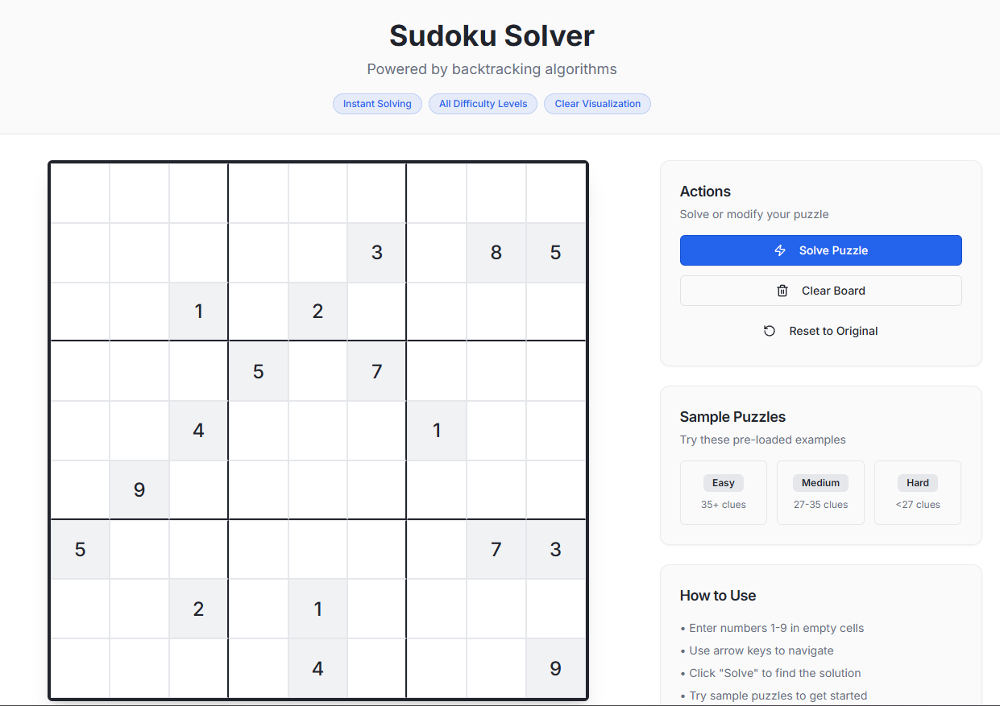
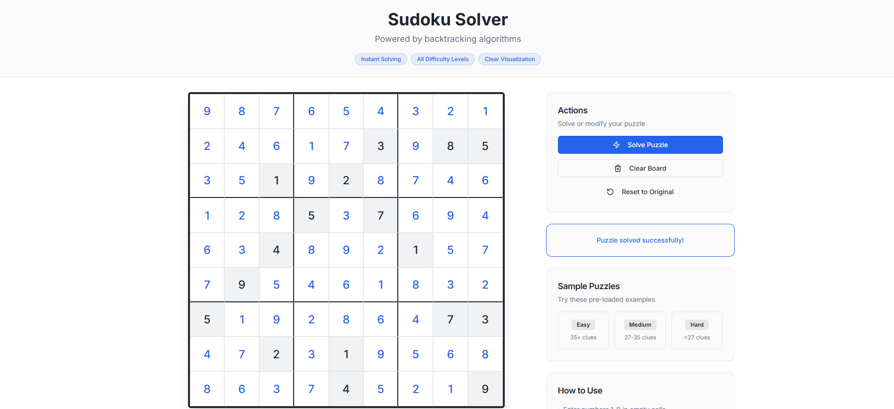

# Full-Stack Sudoku Solver Web App

A complete end-to-end Sudoku Solver web application that allows users to input, validate, and solve Sudoku puzzles in real time. The project integrates a modern React-based frontend with a TypeScript-powered backend and a recursive backtracking algorithm for efficient puzzle solving.

---

## 1. Overview

The Full-Stack Sudoku Solver is composed of three main layers:

- Frontend: Built with React and Vite for an interactive web interface.
- Backend: Developed using Express and TypeScript to handle API logic and solver execution.
- Solver Engine: A pure JavaScript implementation of the backtracking algorithm for solving puzzles efficiently.

The app enables users to input Sudoku puzzles, validate board configurations, and request AI-assisted solutions with instant feedback.

---

## 2. Architecture Overview

### Frontend
- Developed using React + Vite.
- Contains the `SudokuGrid` component for rendering a 9×9 interactive board.
- The `ControlPanel` component handles Solve, Validate, and Clear interactions.
- Uses Tailwind CSS for responsive design and styling.

### Backend
- Implemented in Express with TypeScript support.
- Hosts API routes (`/api/solve`, `/api/validate`) for puzzle processing.
- Integrates with Vite middleware for seamless development in a single server context.

### Solver
- Defined in `sudoku-solver.js`.
- Implements recursive backtracking for constraint-based Sudoku resolution.
- Handles invalid or unsolvable configurations safely with structured error responses.

---

## 3. Project Structure

```
root/
├── client/
│   ├── index.html
│   ├── src/
│   │   ├── App.jsx
│   │   ├── components/
│   │   │   ├── SudokuGrid.jsx
│   │   │   └── ControlPanel.jsx
│
├── server/
│   ├── index.ts
│   ├── routes.ts
│   ├── vite.ts
│   ├── sudoku-solver.js
│   └── schema.ts
│
├── screenshots/
│   ├── interface.png
│   └── solved.png
│
├── package.json
├── vite.config.ts
├── tsconfig.json
└── tailwind.config.ts
```

---

## 4. Solver Logic

### Core Functions

| Function | Description |
|-----------|-------------|
| `isValidSudoku(board)` | Verifies the input grid has valid dimensions and no duplicate entries. |
| `isValid(board, row, col, num)` | Checks whether a value can be placed at a specific position. |
| `findEmptyCell(board)` | Finds the next empty cell on the board (denoted by 0). |
| `solveSudoku(board)` | Performs the recursive backtracking search for a valid solution. |
| `solve(board)` | Main entry logic for validation, deep copying, and result generation. |

### Algorithm Overview

1. Identify the next unfilled cell.
2. Attempt placing numbers 1–9 sequentially.
3. Validate each placement using Sudoku constraints.
4. Recurse for the next cell until the puzzle is solved.
5. Perform backtracking when a placement leads to conflict.

---

## 5. Data Flow

### Step 1: Input
Users input Sudoku numbers through the UI grid and initiate solving or validation actions.

### Step 2: API Request
The frontend submits the grid data via JSON to the respective server endpoint.

### Step 3: Processing
The server runs the backtracking solver and validates the puzzle structure.

### Step 4: Output
A structured JSON response provides the solved board or an error message, which updates the UI instantly.

---

## 6. Screenshots

### Main Interface


### Solved Puzzle


---

## 7. Installation Guide

### Prerequisites
- Node.js (v16+)
- npm or yarn

### Setup Steps

```bash
# Clone repository
git clone https://github.com/your-username/fullstack-sudoku-solver.git
cd fullstack-sudoku-solver

# Install dependencies
npm install

# Run development environment
npm run dev
```

Open **http://localhost:3000** to preview the app in your browser.

---

## 8. API Reference

### POST /api/solve
Solves a given Sudoku board.

**Request Example:**
```json
{
  "board": [[5,3,0,0,7,0,0,0,0], [6,0,0,1,9,5,0,0,0], ...]
}
```

**Response Example:**
```json
{
  "success": true,
  "solution": [[5,3,4,6,7,8,9,1,2], ...]
}
```

### POST /api/validate
Validates Sudoku board configuration.

**Response Example:**
```json
{
  "success": false,
  "message": "Duplicate entry found in column 4"
}
```

---

## 9. Configuration Files

| File | Purpose |
|------|----------|
| `package.json` | Lists dependencies and scripts. |
| `vite.config.ts` | Defines build and dev server configuration. |
| `tsconfig.json` | TypeScript compiler settings. |
| `tailwind.config.ts` | Tailwind CSS theme customization. |

---

## 10. Design Guidelines

See `design_guidelines.md` for detailed UI/UX standards, including:

- Component layout and hierarchy.
- Grid responsiveness strategies.
- Color palette accessibility.
- Mobile and desktop design considerations.

---

## 11. Technology Stack

| Category | Technology |
|-----------|-------------|
| Frontend | React, Vite, Tailwind CSS |
| Backend | Express, TypeScript |
| Algorithm | Recursive Backtracking (JavaScript) |
| Dev Tools | Node.js, ESLint, Prettier |
